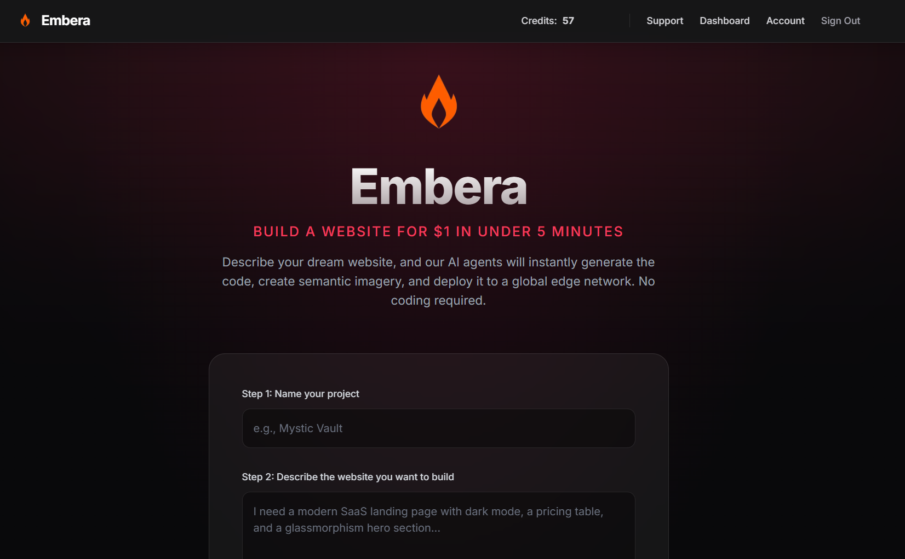

# Embera

This is the public showcase repository for **Embera**, an orchestration layer that lets you generate and deploy full web applications from a text prompt.

**Try it live:** [embera.io](https://embera.io)

## About Embera

Embera connects natural language directly to live production code. When you describe the app you want to build, the orchestration engine goes to work:
1. It translates your prompt into a full Next.js application architecture.
2. It generates the necessary UI, components, and logic.
3. It automatically deploys the resulting code to Vercel.

No manual coding, configuration, or pushing is required.

## Features

- **Prompt-to-Deployment Pipeline:** Go from an idea to a live URL in minutes.
- **Next.js & React Generation:** Uses modern, high-performance web standards by default.
- **Automated Vercel Integration:** Infrastructure and hosting are handled automatically.

## See it in Action

### Watch the Demo

**Scan the QR Code to visit Embera:**

## Roadmap 

We're constantly improving the orchestration layer. Upcoming milestones include:
- Better authentication and user dashboards for managing generated projects.
- Deeper GitHub integration so you have full source control over the generated code.
- An interactive in-browser editor for iterating on the generated output through conversation.

## Feedback & Support

The core engine for Embera is currently closed-source, but we use this repository to track community feedback, bug reports, and feature requests. 

If you run into an issue or have an idea to improve the platform:
- [Open an Issue](https://github.com/this-nerd/embera-showcase/issues/new)
